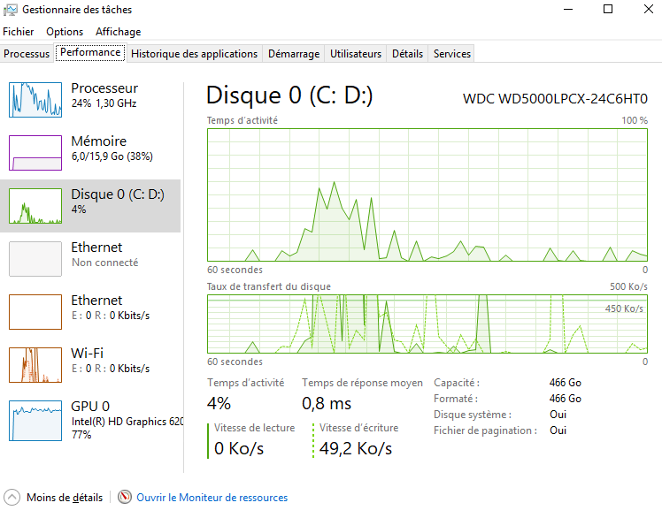
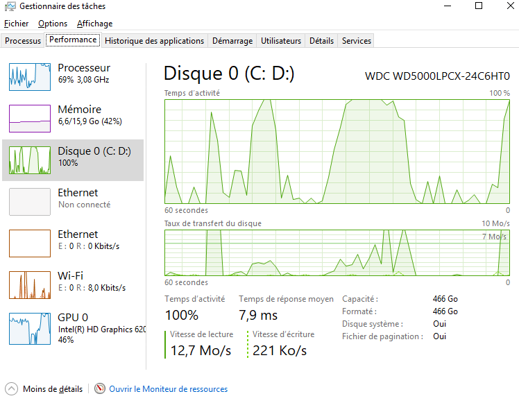

# Compte-rendu d'exercice — Découplage Temporel CPU / GPU

---

## 1. Protocole de mesure & Captures d'écran

* **Application lourde exécutée :** `Pro Evolution Soccer 2017 avec parametre d'affichage élévé`
* **Outil de monitoring utilisé :** `Gestionnaire des tâches `

### Cas A : Au Repos
* **Charge CPU :** **24 %**
* **Charge GPU :** **~77 %** *(Le GPU attend les commandes envoyées par le CPU)*


*Figure 1 : Avant le lancement du jeu*

---

### Cas B : Régime GPU-Bound (Saturé par la carte graphique)
* **Charge CPU :** **~70 %** *(Le CPU attend que le GPU libère de la place dans la file)*
* **Charge GPU :** **juste avant de redescendre à 46% le GPU affichait 100 %**


*Figure 2 : Saccade provoquée par la complexité des Shaders ou le manque de bande passante VRAM.*

---

## 2. Analyse : Lequel des deux le chronomètre mesure-t-il ?

Lorsqu'on placez un chrono (`std::chrono::high_resolution_clock`) autour de votre boucle de rendu C++ :

```cpp
auto start = std::chrono::high_resolution_clock::now();

// Appel de rendu CPU (ex: glDrawElements, vkCmdDraw)
RenderFrame();

auto end = std::chrono::high_resolution_clock::now();